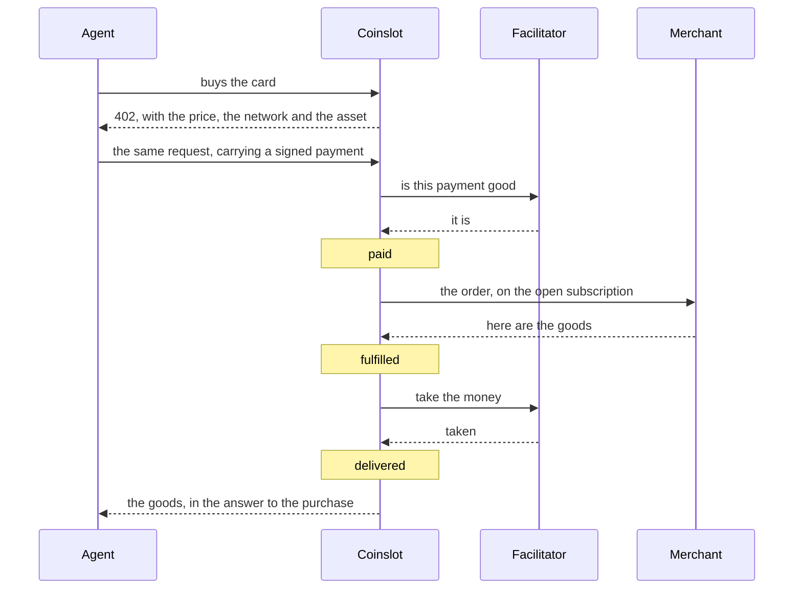
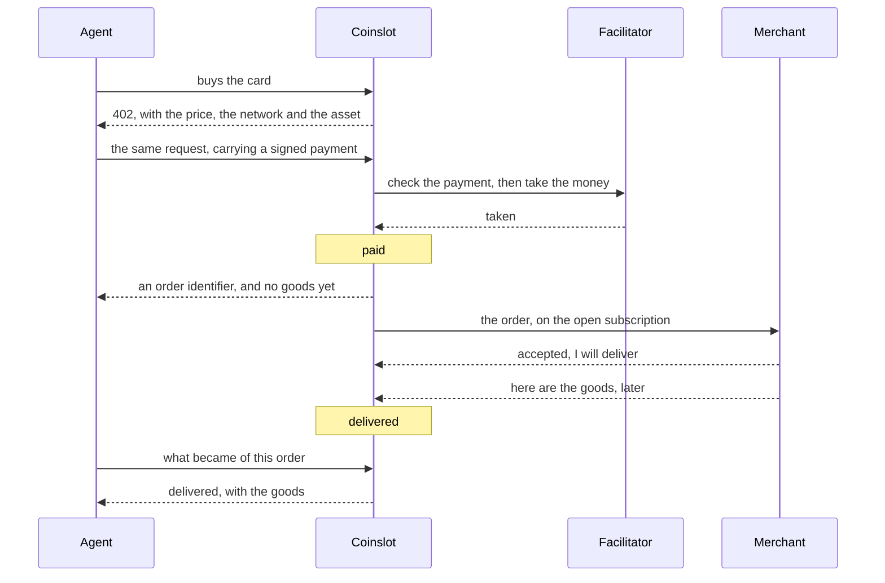
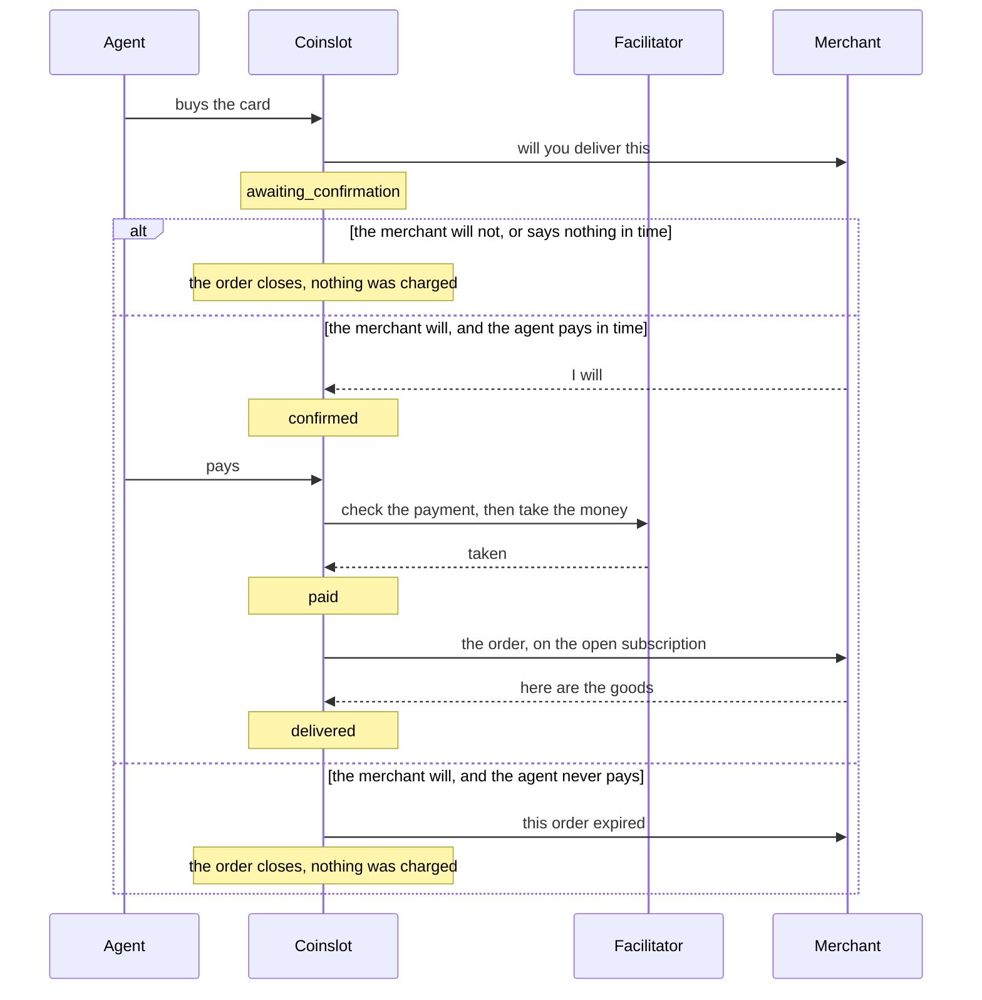

# Coinslot

The gateway through which an ordinary online business sells its goods to AI
agents, paid in stablecoins over the x402 protocol. The money goes from the
buyer's wallet to the merchant's and never passes through us. There is no
external merchant yet. The first installable SDK is `0.1.0` and speaks contract
version `"1"`; from that registry release onward, unreadable wire changes move
the contract version before the gateway sends them (ADR-0006).

This file orients an engineer who has just opened the repository.

## Run it

```
docker compose up --build
open http://localhost:8080
```

One origin, one port: the landing at `/`, the merchant documentation at
`/docs`, the cabinet at `/cabinet`, the merchant's own calls at `/v0`, the
storefront an agent buys at under `/x402`, Postgres behind them.
A merchant process comes up beside it and publishes two cards — a rented phone
number sold synchronously, an eSIM sold asynchronously.

Nothing buys by itself. The buyer is the one thing that runs on the host rather
than in the stack, so the workspace needs its dependencies first:

```
pnpm install
pnpm buy                      # the first card in the catalogue
pnpm buy esim                 # the one delivered later
```

The gateway settles against nothing locally (ADR-0008): a purchase completes
with no wallet, no network and no faucet, and the first line of its log says so.

The cabinet is where a merchant sets the name buyers see and issues the keys
their own code calls with. The way in is to register:

```
open http://localhost:8080/cabinet/register
```

The form asks for an email, a password and an invitation. The invitation is
`register-on-this-laptop`, which `compose.yaml` sets by default. Registering
makes the merchant, signs you in as them, and puts you on the one question the
form did not ask — the name buyers see. The credential the cabinet acts as that
merchant with is made and held by the cabinet; it is never something you type.

That merchant is a new one, and it is not `the_merchant` — the merchant the
stack seeds, whose two cards the merchant process publishes and `pnpm buy`
buys. Somebody who has just registered has no cards and no keys of their own,
which is the truth about a merchant who has written no code yet (ADR-0014).

If port 8080 is taken, `COINSLOT_HOST_PORT=8090 docker compose up` moves the
stack and nothing else — the buy command runs on the host and needs
`GATEWAY_URL=http://localhost:8090 pnpm buy`.

## What happens in a sale

A card is one product written so that a program can decide to buy it: a title,
a description, a price, and the list of what has to be given at purchase. A
merchant publishes cards through the SDK, and every card is an address an agent
can pay against.

The purchase is an HTTP request to that address. The gateway answers `402
Payment Required` with a challenge naming the price, the network and the asset;
the agent signs a payment and repeats the request carrying it. That exchange is
x402, and the protocol itself comes from the official packages — what this
repository adds is knowing which order a payment is for.

The merchant's side is one process standing beside their existing API: a
handler. It listens on no port — it opens a single outgoing subscription and
receives paid orders, price questions and order events on that one stream
(ADR-0004). Everything it is written against is `@nuanu-ai/coinslot`.

The order is a state machine of sixteen states in `packages/core`, a pure
function with no IO. The gateway feeds it events and gets back the next state
together with the effects that state implies, and those effects are written
down in the same transaction as the state itself (ADR-0013). What the card
declares before payment is which of the three sequences below the sale follows.

### Synchronous fulfillment

The goods come back in the answer to the purchase, and the money moves only
once the merchant has produced them. A refusal costs the buyer nothing.



The goods are held until the money settles, so a delivery whose charge failed
hands nothing over.

### Asynchronous fulfillment

The money moves at the purchase, before the merchant is asked for anything. The
agent leaves with an order identifier and collects the goods later — minutes
later or a day later, which makes no difference to the shape.



Knowing the identifier is the whole of the agent's proof, so the status call
takes no key (ADR-0011).

### Fulfillment against a confirmation

The merchant says whether they will deliver before the buyer is charged at all,
so this is the mode whose branches matter more than its happy path.



How the agent is told it may now pay is the piece that does not exist. The
machine emits an `invite_payment` effect at the confirmation and the gateway
throws on it rather than invent a message no contract describes, which is what
closing the mode at the door means: a card asking for `confirm` is refused at
publication, and ADR-0007 lists what wiring it up would touch. The branches
above are the machine's — driving it through the three endings is where they
come from — and the payment arrow deliberately does not say how the agent
learned it was invited.

## The stand

A purchase has three participants, and the stand is a local console that lets
one person sit in each of them in turn. It is our own instrument rather than a
product surface — no merchant is handed it, it is not a second interface to the
gateway, and it listens on loopback only — but its merchant half is written to
be read by somebody integrating against the SDK. Everything a merchant's code
can do there goes through `@nuanu-ai/coinslot`: the subscription, publishing,
the orders and the calls that close them. Where a call is not on the SDK the
console says so at the button, because those are the merchant's cabinet
operations and the package does not carry them by decision.
`packages/slice/src/stand-merchant.ts` is the file to read.

```
pnpm stand
open http://127.0.0.1:8787
```

It needs a wallet of its own, because the buyer on it signs real payments. Put
a throwaway test key in `.env.stand` at the root of the repository as
`STAND_BUYER_KEY=0x…`, sixty-four hexadecimal characters, and never one holding
anything you would miss; `.env.*` is not committed, and the stand refuses to
start without a key rather than falling back to one everybody knows.
`STAND_PORT` moves it off 8787.

The console asks for a gateway address and a merchant key, and keeps the key in
its own process — the page and the log are handed the environment that key
names and never the key. Against the stack above the address is
`http://localhost:8080`.

Three tabs, one per seat. **Catalogue** publishes cards through the real SDK and
takes them off sale, and every row carries the address an agent buys that card
at. **Agent** is a stranger's buyer: the public catalogue as an agent reads it,
the two probes — the GET that quotes a card and opens nothing, the unpaid POST
that opens an order — and then the challenge, which sits on screen with its
requirements until you sign it, send something unreadable, or walk away.
**Orders** is the merchant's own code with you in its chair: a standing answer
for whatever arrives next, or hold every order and decide each one by hand.

The log runs down the side of all three and is threaded by the order, so a
purchase told from three seats reads as one conversation. It carries both
halves of every exchange the console makes, and says what it leaves out: the
SDK's own polling and the gateway's internal steps are not in it.
`docs/research/24-stand-boundary.md` is what the stand does and does not prove
— it is not the gateway's journal, and the payment layer is outside it.

## Where things are

- `apps/gateway` — the payment edge, the order runner and the queue; ports in
  `src/ports`, their implementations in `src/adapters`.
- `apps/cabinet` — the merchant's screens: cards, orders, receipts, keys.
  Server-rendered, no client build (ADR-0005).
- `apps/landing` — the public page, static.
- `packages/contracts` — every shape that crosses a boundary, as zod schemas,
  and the route table both sides import instead of transcribing.
- `packages/core` — the order state machine: pure logic, zero IO, zero runtime
  dependencies.
- `packages/sdk` — what a merchant integrates against; its runtime tree is our
  contracts package and zod, and nothing else.
- `packages/slice` — a mock merchant and a buyer, driving the offline gate and
  the two commands above, and the stand.
- `portal/` — the merchant documentation, a vitepress project of its own with
  its own lockfile, outside the workspace.
- `docs/decisions/` — the numbered decisions; `docs/research/` — the working
  material behind them.
- `spikes/` — experiments living on their own dependencies.

Gateway and cabinet share one Postgres and each owns its migrations under
`drizzle/`; `pnpm db:migrate` runs both.

## Checks

```
pnpm check          # formatting and lint
pnpm typecheck
pnpm test           # offline, free, no network
pnpm check:decisions
```

That is the gate before a push, and CI runs the same on every push and pull
request. Automatic test and live delivery is paused during the public cutover.

Three more cost something and are kept apart for that reason:

- `pnpm test:db` needs a Postgres (`docker compose up -d --wait postgres`) and
  fails rather than skipping when there is none.
- `pnpm outside` packs the tarballs npm would publish, installs them into a
  directory with no path back here, and runs the commands the quickstart gives
  a merchant.
- `pnpm smoke:listing <https address>` asks Coinbase whether our resource would
  be listed, and reports no verdict rather than a pass when it cannot reach us.

## Where to read more

- `docs/vision.md` — what the product is, for whoever is deciding whether to
  connect.
- `portal/` — what a merchant reads: the owner's decision, the engineer's
  integration, the operator's questions.
- `docs/decisions/` — what is expensive to reverse, and why it was decided that
  way.
- `AGENTS.md` — the working discipline: how decisions are recorded, what a test
  has to answer for, why a check that did not run never reports success.

The portal's JSON examples and its tables of how an order can end are read by
the contracts and core test suites out of the very files the pages render, so a
page and the behavior it describes cannot drift apart quietly.

Engineering artifacts are written in English; research and product documents in
the language of their readers, which is why some of the above is in Russian.

## License

Coinslot is licensed under the Apache License 2.0. Distributions must retain
the notices required by that license, including the attribution to Nuanu AI in
[`NOTICE`](NOTICE). See [`LICENSE`](LICENSE) for the license terms.
