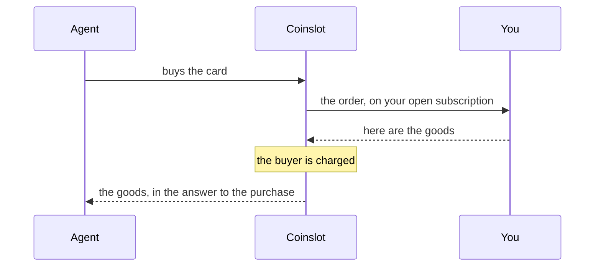
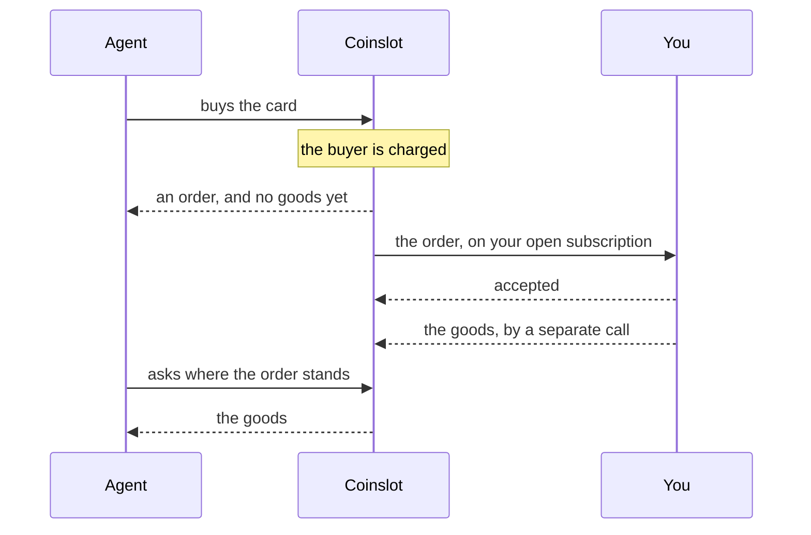
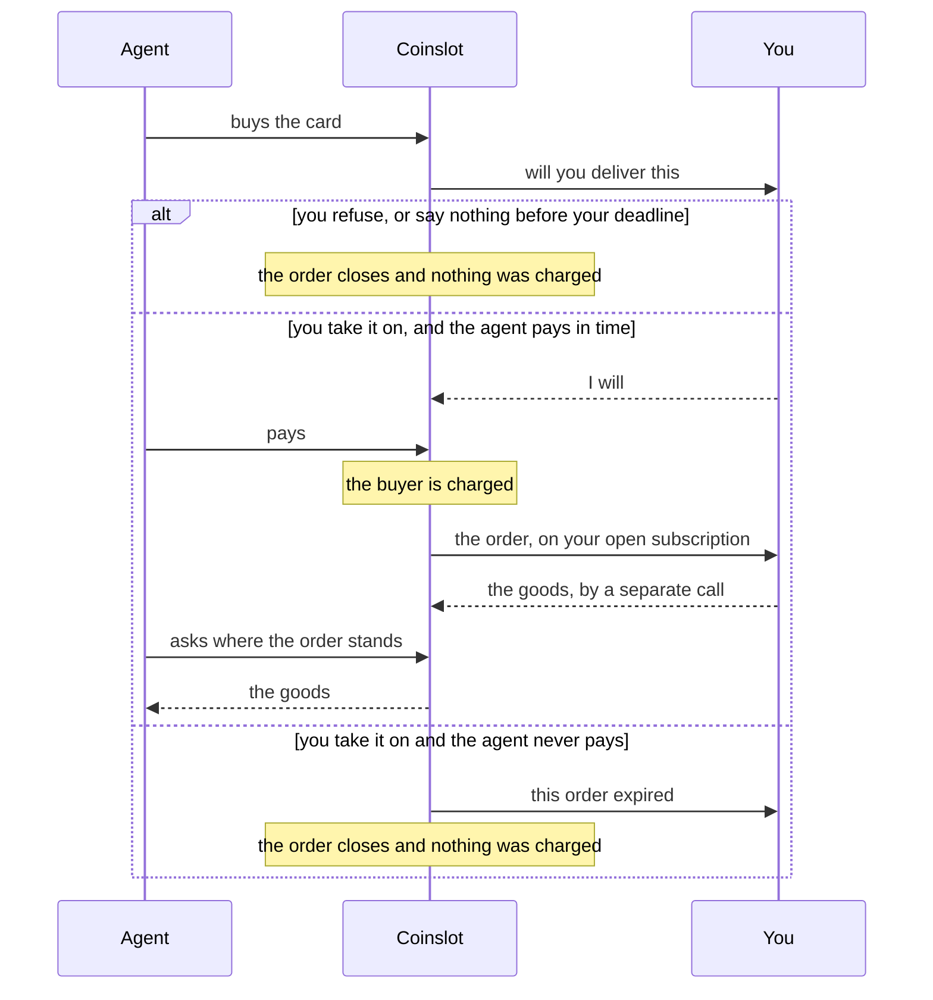

# Orders and fulfillment modes

*A preliminary contract: the wording can still change before the pilot.*

You are writing the handler that takes paid orders and gives out the goods for
them. Everything it rests on is collected here: what the fulfillment modes are,
what arrives in the handler, how an order can end, and what happens when time
runs out. The working words — card, handler, idempotency key — are defined on
[The first test sale](/quickstart), and the individual failures are collected
on [What can go wrong](/failures).

::: warning The names of the calls and the fields are preliminary
What is fixed is the model and not the signatures. Of the machine names `id`,
`merchant_item_id` and `as_of` are final; the other names on this page are
working names and can still change before the pilot.
:::

## Three fulfillment modes

| Mode | `fulfillment` | The goods reach the agent | When the buyer is charged | If you refused or stayed silent |
| --- | --- | --- | --- | --- |
| Synchronous | `'sync'` | in the answer to the purchase | after your delivery, as the last step | the purchase did not happen and the buyer spent nothing |
| Asynchronous | `'async'` | later, by a separate call | at the moment of purchase, before your delivery | the money is with you and the buyer has no goods: the order is marked as needing a refund |
| With confirmation | `'confirm'` | later, by a separate call | right after your confirmation | before the confirmation nothing is charged; after it, as in the asynchronous mode |

The mode is declared in the card, and the agent knows it before it pays. The
product decides which mode it is, and the channel only narrows the choice: a
connected API delivers both synchronously and asynchronously, while an order
that arrived as a message is never synchronous. What the moment of charging
means for the owner of the business is on [Money](/money).

The third mode is not open during the pilot. A card cannot be published with
`fulfillment: 'confirm'`, because the request that asks you to confirm has no
shape on the wire yet and your handler could not tell one from a paid order.
The rest of this page describes the mode as it is designed.

From the agent's side the asynchronous mode and the confirmation mode look
almost the same: the order and the way of watching where it stands are
identical. What differs is the moment of charging, and one consequence of
confirming — a confirmed order acquires a deadline for the agent to pay it in.

The three sequences below are the same three rows of the table, in the order
the steps actually happen. The payment network is left off them: what reaches
you is the order, and where the charge falls relative to your delivery is what
the modes differ by.

### Synchronous

Nothing is charged until you have delivered, so a refusal leaves the buyer
having spent nothing.



### Asynchronous

The buyer is charged before you are asked for anything, and the goods follow by
a separate call — a minute later or a day later, which changes nothing here.



### With confirmation

Nothing is charged until you have said you will deliver. Your answer is the
branch the order takes, so this diagram shows all three of its endings rather
than the one where everything goes well.



Between your "I will" and the agent's payment the clock is the agent's, and
you are not waiting on your own deadline there — the third branch is how that
ends, and it reaches you as an event on the same subscription.

## Where an order comes from

A purchase starts on our side. The agent finds the card, we work out the price
— from the card, or from your price check's answer — and we check the payment.
Only after that does the order appear on yours. Invalid purchases, stale prices
and payments that failed their check never reach your handler.

### What an order is made of

| What | What it is for |
| --- | --- |
| `id` | the order's identifier, and its idempotency key: the same across every repeat |
| `merchant_item_id` | your own key for the product, the one it has in your database |
| `params` | the purchase parameters, already checked against the card's declaration |
| `price` | the sale price: the amount, the currency, the moment that price was fixed for this sale, and the `as_of` of the price it was worked out from |
| `price_id` | the identifier of the price question this sale came out of, absent where the card has no price check |
| `test` | the mark of a test order |

Say an agent buys a month of access. What reaches your handler is your own
`access-monthly`, the email address the agent gave at purchase, an order
identifier of the form `ord_7c1e05` — by which you recognise this same order if
it arrives again — and the sum the access was sold for.

The price is in the order because the sale may not have gone at the card's
price: where a product has a price check, the sale went at the check's answer.
You get the final sum, its currency, the moment that price was fixed for this
sale and the `as_of` of the answer it was worked out from, which is enough to
record the sale on your side without looking the card up. There is no need to
compare that sum against your own price list and refuse on a mismatch — we catch
a mismatch before the order leaves for you.

The two moments are worth keeping apart, and neither of them is the moment the
money moved. On a card with no price check the price is fixed the instant the
agent asks to buy, and its `as_of` is when that card price was published. On a
card with a price check it is fixed when your answer comes back, its `as_of` is
whatever your answer said the price was true as of, and the agent may spend a
while after that deciding whether to pay. When the money actually moved is on
the receipt, under a name of its own.

The field `price_id` ties the order to your own answer about the price: if you
set stock aside against the price you named, this is the moment to write it
off. The identifier is good once, and no second order arrives under it.

### What a handler can answer

A handler has three answers:

- a delivery — JSON to the result declared in the card; the order closes as a
  success;
- a refusal — a short code and a reason a person can read, with the codes
  collected in the [vocabulary of refusal codes](/cards);
- taking the order on, where the goods leave later: you confirm the delivery
  itself with a separate call.

Those three are what a handler returns. The same three exist as calls you make
from outside a handler — `deliver`, `refuse` and `accept` — and the two that
close an order have sections of their own below.

Those three are the whole set, and that matters for how you report a temporary
failure. An exception in the handler, a process that fell over, a connection
that broke — for us each of these means the order never reached you: the answer
did not arrive, so we send the order again, after a delay, until the mode's
deadline runs out or we have delivered it five times, whichever comes first.
Five is what this system is set to, and no card changes it. Either way the order
closes as though the deadline had passed. We read a refusal the other way, as a
final "this cannot be delivered", and we close the order on it. So a supplier
that did not answer within five seconds is not worth a refusal: throw instead.

Silence does not count as an answer: every wait has a deadline, and an order
that runs past its deadline closes without you.

### The confirmation mode

In this mode one more step comes before the order. The request to confirm
arrives on the same subscription the orders do and is marked as a request to
confirm: the purchase parameters and the price are already in it, and no money
has moved for it yet. Your handler answers it the way it answers an order, with
whichever of the two answers hands nothing over — taking it on means "I will
deliver", a refusal means "I will not". The goods cannot go out in that answer,
because they have not been paid for.

Answer that you will deliver, and the agent's clock for paying starts; after
the payment the same order reaches you in the ordinary way. Answer that you
will not, or stay silent past your deadline, and the order closes with the
buyer having spent nothing.

## Confirming a delivery with a separate call

You close an order you took on with `deliver`, once the delivery is finished.
The call is made on the order itself — the object that arrived in your handler,
or the one you read back from us — and it takes one argument: the result, to
the shape declared in the card, which goes to the agent as it is.

```ts
await order.deliver({ access_url: url, expires_at: until })
```

A delivery carries exactly what the card's result declares: every field it
promises the agent, in the type it names, and nothing it does not name
([Delivery result](/cards#delivery-result)). Goods that do not fit are refused
with the offending fields named, and the order does not move at all — nothing
of what you sent is written down, no receipt is issued, and no deadline of
yours moves. Fix what the refusal names and deliver again.

That refusal also tells you whether the order is still there to finish, and it
is worth reading before you make the goods again. Goods are weighed against the
card and never against the state of the order, so the fault in your handler is
what you hear about first either way. But an order still yours to finish is
refused with the words that it stands where it did, marked as worth calling
again: fix the handler and deliver. An order that has ended — one that ran out
of time, one you refused yourself, one whose refund has gone out — is refused
with its ending named and marked as not worth calling again, and the fields that
did not fit are still listed. There is nothing left to deliver against, and a
handler that ignores that mark makes the goods once for every attempt.

The check stands in front of every delivery that could put goods on the order,
whether it comes back from your handler or from a `deliver` call, and whether
it arrives on time or late.

The call is idempotent by the order's identifier. Call it a second time with
the same `order.id` and it succeeds again, marked as already delivered: no
second delivery happened and no second charge. There is nothing here for your
code to treat as a failure: `ok` is true in both cases, and you do not have to
branch on the word inside it. The word is there when you do want it — a delivery
that closed a refund debt rather than completing a sale says so. Repeating the
call after a dropped connection is therefore safe. A repeat is not weighed
against the card at all, because there is nothing left for it to write: what it
carries is neither checked nor kept. What it ought to carry is in [Telling a
repeat apart](#telling-a-repeat-apart).

A late call is accepted. If your delivery deadline has passed, the order is
already marked as needing a refund and the refund has not yet gone out,
`deliver` closes the debt with the goods: the money for them has been paid, and
late goods are better for the buyer than a refund. If the refund has gone out
by then, the call returns an error — there is nothing left to deliver against.

### When a closing call does not go through

`deliver`, `refuse` and `accept` hand their failures back rather than throwing
them, in the envelope every call on this surface answers in: `ok` is false, and
one `error` beside it carries a code to branch on, a sentence a person can read,
and `retryable`. Seven codes are promised to mean one thing each — four sent by
us, and three the tools produce when no answer they could read came back. The
set is open beyond those seven, so a case nobody anticipated reaches you in its
own words instead of being flattened into the nearest of these.

| Code | When it arrives | Repeating could change it |
| --- | --- | --- |
| `refund_already_settled` | the buyer has their money back for this order, so there is nothing left to deliver against | no |
| `order_already_closed` | the order reached an ending that no call reopens | no |
| `not_applicable_in_mode` | the call does not exist for this card's mode: in the synchronous one the handler's own answer is the delivery and the refusal | no |
| `delivery_does_not_match_card` | the goods are not the ones the card declares, so nothing was written down | while the order still stands, yes — with different goods; once it has ended, no |
| `call_did_not_reach_us` | the call never got to us, so it did nothing | yes |
| `answer_not_understood` | it reached us and came back in words these tools cannot read, so it may well have done its work | yes |
| `outcome_unknown` | it went out into silence — the connection broke, the process was stopped mid-call — and nothing on your side knows whether it landed | yes |

The flag says that repeating the call could change the outcome. It does not say
that repeating is safe, and those are two questions rather than one. `deliver`
and `accept` are idempotent by the order's identifier, so for them the answer to
both is yes: send the call again and nothing is delivered or charged twice.
`refuse` carries no such promise, so a refusal that failed is worth reading back
with `get` before it is sent a second time. And `delivery_does_not_match_card`
means a third thing by the flag: that call arrived and was understood, so the
same goods sent again get the same refusal, and the retry that helps is the one
carrying what the card declares.

A code outside those seven is the ordinary case rather than the exception, and
the commonest one is us refusing the call at the door: a key we will not take,
an order identifier that names nothing, a body we could not read. Those come
back under our own word for the refusal — `not_authorised`, `no_such_order` —
because that word is the one that tells you what to do about it. The three the
tools produce say only what they say: no answer arrived, or one did and could
not be read. Neither is ever put in front of a refusal we wrote out in words.
On a refusal of ours the flag is ours too, and we assign it carefully. It is
true only where making the same call again is genuinely the way through — the
call that fell over before anything was decided, the order whose price is not
worked out yet. Everything settled, and everything we are merely unsure about,
is false: a key we will not take, an order that is not there, a card its
merchant has paused. Some of those do change eventually, but not because you
called again, and a flag that said otherwise would have you polling a door
somebody else has to open.

The three the tools produce keep the flag true, and there it means something
weaker. Those are not refusals at all: no answer arrived, or one arrived that
could not be read. Nothing is known about the call, so nothing is claimed about
it — trying again is worth doing precisely because the first attempt settled
nothing.

Where the error is about the goods you sent, what did not fit travels as
findings in `error.problems`, and that list is the complete account. A field
your card declares and your delivery got wrong is one finding there, carrying
the path to it, a code and words a person can act on. The fields your card never
declared are one finding between them, with an empty path — there is no path to
a name the card never had — and all of those names inside its own words. The
`message` beside the list is a single line, written to be read in a log: it says
how many findings there are, quotes one or a few of them, and marks the place
where a long one was cut short. Print that to a person; branch on the list.

## Refusing after you have taken the order on

Taking an order on does not bind you: while the order is open, you can refuse
it with a separate call.

```ts
await order.refuse({
  code: 'out_of_stock',
  message: 'The supplier did not confirm the number',
})
```

The call is for the places where you have already answered that you took the
order on: the asynchronous mode, and the confirmation mode after the payment.
In the synchronous mode the handler refuses in its own answer, and there is no
separate call there at all.

The buyer has already been charged for an order you took on, so a refusal marks
the order as needing a refund straight away. There is nothing to gain by
waiting out your delivery deadline and arriving at the same result through
silence: the buyer hears about the debt the minute you do, instead of a day
later.

## Finding out where an order stands

We remember where the orders stand as well, so you can ask us at any moment.

```ts
const order = await coinslot.orders.get(orderId)
const open = await coinslot.orders.list({ open: true })

for (const waiting of open) {
  // This one has its goods already; it is waiting on money rather than on you.
  if (waiting.status === 'delivered_unpaid') {
    continue
  }

  const issued = await accessFor(waiting.id)

  if (issued !== null) {
    // On an order marked as needing a refund this closes the debt with the
    // goods instead of paying the money back.
    await waiting.deliver({ access_url: issued.url, expires_at: issued.expiresAt })
  }
}
```

The first call returns one order, the second every order still open. They are
for the case where your process restarted and no record of the order is left on
your side: the list of open orders shows what is still owed something, so the
picture does not have to be rebuilt from your database alone. Neither has a
failure branch to hand you — an order or a list is all they can answer with — so
when they cannot reach us they throw, as a `CoinslotError` carrying a `code`
from the same set the closing calls return and the `route` it happened on. That
is worth remembering about a loop that runs the moment a process comes back up.

Orders from here carry the same calls that orders from the handler do:
`deliver` and `refuse` are made directly on them. They also carry one field a
handler's order does not: the word for where this one stands.

After a restart your process therefore walks the list, asks itself what is
ready for each order, and closes what is ready — without collecting identifiers
of ours into a variable of its own. What is ready is yours to know and not
ours.

Open here means the order is still owed something, by you or by the buyer or by
us, and that is a wider set than the orders you have been handed. It holds an
order the agent has been given a price for and has not paid, which has never
reached your handler. It holds an order marked as needing a refund, where
delivering closes the debt with the goods instead of paying the money back, and
that may be what you want.

It also holds orders that already have their goods and are waiting only on
money, and those are the ones a loop over the list has to step around. A
delivery against an order that already has its goods is answered as a success,
and nothing of what it carried is written down or reaches the agent.

One of them you can see coming: an order you delivered synchronously whose
payment did not execute reads `delivered_unpaid`, which is why the loop above
skips it. The other you cannot. An order whose goods are made and whose charge
is still running, or was never answered for, reads `in_progress` — the same
word as an order that is still waiting for you.

So a loop over this list rests on your own record of what you have already
sent. One that makes the goods afresh for every order it finds will issue a new
code, be told it succeeded, and lose it
([Telling a repeat apart](#telling-a-repeat-apart)).

If your own record of the order did survive and it holds our identifier — a job
in a queue, a row in your database — the order can be assembled from it without
asking us anything:

```ts
await coinslot.orders.forId(savedId).deliver({ access_url: url, expires_at: expiresAt })
```

That call asks nothing, and so it works even when we cannot be reached: `get`
and `list` at such a moment throw, while a delivery against a saved identifier
goes out and comes back as an error flagged worth repeating. It does not read
the order itself — there are no purchase parameters and no state in it, only
the calls that close an order.

## Events on the same subscription

Besides orders, the same subscription carries events: messages about something
that happened to an order without you. A handler for them is declared the way
one is for orders, with `coinslot.on('event', ...)`, and it sends nothing back
— an event tells you something happened and asks for no answer.

An event is sent once and is never sent again, and that is the opposite of the
rule for orders on the same subscription. Your answer is what acknowledges an
order — any of the three, including taking it on — so we can tell whether it
arrived and send it out again when it did not. An event is the price of asking
for no answer: nothing on our side is waiting for a reply to it, so one that
went into a batch your process never received is simply gone. Nothing brings it
back, and nothing afterwards announces that one went missing. So the guard an
order needs is against a repeat, and the guard an event needs is against a
silence; a handler written for one of those rules and pointed at the other gets
that one wrong.

The silence that costs money is the notice that an order needs a refund. The
buyer has paid, the goods did not go out, the one message that would have told
you did not arrive — and the money sits with you while nobody asks for it. What
closes that hole is the list of open orders. Every order still owed something is
on it, an order marked as needing a refund included, so walking that list finds
what a lost event would otherwise have been your only word of. Walk it on a
schedule and not only after a restart: a process that stayed up loses an event
the same way one that went down does, and it has no restart to prompt it.

| Event | What happened |
| --- | --- |
| An order was marked as needing a refund | you did not deliver in time, you refused after the charge, you left with a paid order still open, or a charge we had given up on reported in late |
| A confirmed order was not paid for | you answered that you would deliver and the agent did not pay in its own time; you are free |
| A payment did not execute after a synchronous delivery | you delivered, and the charge either failed or went unanswered |

The last cause of a refund is the one that will not match your own record: a
charge we had written off as never having happened reports in afterwards, and
the buyer is owed the money back through no fault of yours. That event carries
a short reason beside the sum, and the reasons are three where the causes above
are four: a refusal has its own word and a departure has its own, while both the
deadline you ran past and this late charge arrive as the deadline — ours, on the
charge, rather than yours on the goods. The vocabulary has no word for that last
one, and inventing a fourth on the wire is a decision nobody has taken.

## You delivered and the payment did not execute

A rare case, and possible only in the synchronous mode. We check a payment
first and execute it as the last step, after your delivery; between the check
and the execution the funds can leave the buyer's wallet for something else.
Then you have produced the goods and there is no money for them.

In this case the goods are recorded and the money is not, and an event goes out
to you, so there is no need to go looking for such cases by reconciling
transfers. Like every event it is sent once and can be lost on the way
([Events on the same subscription](#events-on-the-same-subscription)), and what
survives that is the order itself: it stays open on your side, and the list of
open orders shows it whether the event arrived or not. For the agent the
purchase did not happen: we hand the goods over after the payment executes, so
it received neither the goods nor a charge.

Two situations reach you through that one event, and they part on what the
payment network finally said. The order carries the word that tells them apart,
so read it back before you act on either.

Where the charge came back failed, the order reads `delivered_unpaid`, and a
repeat purchase closes it: the agent repeats it under the same key, the payment
executes, and the order closes on the delivery you have already made — there is
no need to deliver a second time.

Where the payment network was asked and never answered, nobody can say whether
the buyer was charged, and we do not pretend to. A repeat is refused there,
because a second charge on top of a first one nobody has heard from would be
spending the buyer's money on a guess about the first. The order reads
`in_progress`, the same word as an order still waiting for you, and nothing on
our side asks the payment network again — so it can sit there indefinitely. If
a late answer does arrive and it says the money moved, the order closes as
delivered and the agent gets its goods; if it says the money did not move, the
order becomes one a repeat purchase can close.

In both cases the goods are already recorded on our side, so there is nothing
to deliver again: a second delivery is answered as a success and nothing it
carries is written down. Whether to revoke what you gave out or to wait is
yours to decide; the size of the risk is bounded by the price of one purchase,
and the owner of the business is told about that risk on [Money](/money).

## How an order can end

An order always closes — with a delivery, with a refusal or on a deadline — and
the agent sees which. Three cases leave the money unsettled, and all three are
rare: the money was charged and no delivery happened; you delivered and the
payment did not execute; and the payment network never said whether the charge
went through. The first two keep the order open. The third closes it, on the
guess that the money did not move — and if the charge reports in afterwards
saying that it did, that closed order becomes a refund you owe.

| Situation | Where the money is | What the agent sees |
| --- | --- | --- |
| You delivered the goods | with you | the goods, the price they were charged and whether the money behind it was real |
| There is none, the parameters did not fit, the payment failed its check — or you refused in the synchronous mode | never moved | a refusal, and that the purchase did not happen; where the refusal was yours, your code and your message arrive with it |
| You answered "I will not deliver" to a request to confirm | never moved | a refusal with your code and your message, and that nothing was charged |
| Time ran out: no confirmation, no payment or no synchronous delivery arrived | never moved | the order was closed on its deadline |
| You left | for what was not delivered, [you send it back](/money) | an unpaid order is closed; a paid one waits for your refund |
| The money was charged and no delivery happened | with you | the order is waiting for a refund |
| You delivered synchronously and the payment did not execute | never arrived | the purchase did not happen; a repeat drives the payment home |
| The payment network did not say whether the money was charged | not known — and nothing on our side is asking again | "the outcome of the payment is not known", not "refused": a repeat under the same key is safe |

A pause closes no orders: cards stop selling, and the orders already taken on
play out in the ordinary way. Only leaving closes the ones that are open.

A status says exactly what the system knows. Where there is no answer from you
yet, that is what the status says, and the agent does not read not knowing as a
refusal.

Where the refusal was yours, the two words you wrote travel with the status: the
code the agent branches on and the message it can show. That holds in every
mode, so an order you refused after the buyer was already charged carries them
as well as one refused before any money moved. Nothing else on this table
carries them, and the difference is worth knowing when you read a status back: a
product the price check reported as gone, a payment that failed its check and a
deadline that ran out have no words behind them, because nobody wrote any.

## Time ran out

An order whose deadline has passed does not hang in the air. It closes, and the
agent sees how it ended. What happens depends on which step the waiting was at.

The numbers are ours to set rather than the card's, and the ones below are what
the system you are connecting to runs with. A price holds for thirty seconds. A
synchronous answer has eight seconds. An asynchronous card can carry one
deadline of yours, on the delivery, counted from the moment the buyer was
charged; name it and the agent sees it before it buys, leave it out and a day
applies that the agent is never shown ([The product card](/cards)). The
confirmation mode has a deadline of its own — an hour, where the card names none
— and it arrives together with the mode.

The eight seconds run from the moment the payment checked out rather than from
the moment the agent first asked, so asking your price — which happens on the
call before the payment — and checking the payment itself are behind them rather
than inside them. They are not the whole of the agent's wait: executing the
charge comes after your answer, on a clock of its own, and the two together fit
inside the ten seconds we promise the agent for a synchronous purchase. Those
ten start where your eight do, at the moment the payment checked out, so the
check is on top of them and not inside: what the agent waits for is the check,
and then the ten.

| Situation | Time ran out — what happened |
| --- | --- |
| The agent has the price and is thinking | the price no longer holds; if it still wants to buy, it asks for a fresh one |
| A request asking whether you will deliver has arrived | the order closed, and the buyer's money never moved |
| The agent owes payment for a confirmed order | the order closed and you are free; an event comes to you |
| You are delivering a synchronous order | the purchase did not happen and nothing was charged; a late delivery is not lost — a repeat collects it |
| You are delivering an asynchronous order | the money is already with you, and the order is marked as needing a refund |

## Telling a repeat apart

By the order's identifier: it is the same across every repeat, and your side
answers with the earlier result under it instead of delivering a second time.
Orders are delivered at least once, so a repeat is ordinary traffic; it does
not mean that anything broke.

On the agent's side the key is the same one, in every mode. The order's
identifier rides in the payment challenge we issue and comes back in the
payment the agent signs, so a repeat names the order it repeats and we carry
that order on from where it stopped. What differs between the modes is only how
much of the purchase was already done when the answer went missing.

One case stands apart: a repeat of an asynchronous order you have already
delivered. You confirmed that delivery with the `deliver` call rather than with
the handler's answer, so the answer to such a repeat is the one you gave the
first time — taking the order on. There is no need to deliver a second time or
to call `deliver` again, because the order is already closed.

The rule to hold yourself to is that the goods on a repeat are the goods you
sent the first time. What the buyer keeps is the first delivery: a later one is
answered as a success, and whatever it carries is neither written down nor
handed to the agent. So a handler that makes the goods afresh on every attempt
— a new access code each time, because the one it made before went back to
stock when its deadline passed — leaves the buyer holding the first code while
your own records say the second one was spent. Nothing in our answer shows you
that: a repeat is answered the same way whether it carried the same goods or
different ones.

Answers that are not the goods may differ freely. You named an expected
delivery time when you took the order on the first time, say, and not the
second; that is not a second delivery and nothing turns on it.

## Running the handler in several instances

One order goes to one instance. Run the handler in three processes and three
subscriptions divide the stream between them, and one order does not land in
two processes at once.

Your answer is what acknowledges an order: until it comes back, the order
counts as open. A process that fell over or reconnected without answering
leaves the order to go out again, possibly to another instance. That is
ordinary behaviour, and it is what the handler's idempotency by the order's
identifier is for.

Within one instance the orders are worked through one at a time. A parameter
for taking several at once is among the things [not settled](/quickstart).

## Test orders

A test order is marked with the `test` flag, which is how a handler tells a
rehearsal from a live sale: send such an order into your own test environment,
answer with a stub, or serve it like any other.

There are two environments, and the flag is the difference between them. The
test one is at `https://test.coinslot.nuanu.ai`: its keys begin `csk_test_`, and
the payments it settles go over a test chain with test funds. The live one is at
`https://coinslot.nuanu.ai`, where the money is real. The flag follows the chain
the payment settled on rather than the key you called with, so every order from
the test environment reads `test: true` and every order from the live one reads
`test: false` ([the addresses and the keys](/quickstart)).

So the flag says which of the two your process is connected to rather than
sorting one stream into two: a process pointed at the test environment sees test
orders and nothing else. That is what makes it worth reading in one code base that serves
both. The same handler can stop short of the real provisioning where the flag is
true, and it will not stop short of a live sale by accident, because a live
order never carries the flag.

The price question that comes before an order carries no flag of its own. It
arrives down the same subscription, so it comes from whichever environment your
client is pointed at; what you cannot do is read a field on the question and
fork on that.

## You did not deliver in time

A synchronous order carries a deadline after which we no longer start your
delivery. The hard case is a delivery that began before the deadline and
finished after it, by which time the purchase is closed as a refusal with
nothing charged.

A synchronous answer has eight seconds, counted from the moment the payment
checked out — asking your price is behind them, and so is whatever the agent
spent deciding to pay, and so is the check on that payment. Say your handler
began the delivery in the seventh second and finished in the tenth. By that
second the agent has already had a refusal and spent nothing, but the access you
gave out has not gone anywhere.

Work already done is not lost: a repeat purchase under the same order key
collects the delivery that was made, this time with the payment. So answering
with the earlier result under the key is worth doing after the deadline has
passed too.

Being late is not in itself an error and does not come back as an exception.
The goods are read before the state of the order is, so a late answer whose
goods do not fit the card is refused for the goods — and the refusal names the
ending as well, and marks itself not worth calling again, so you are not left
fixing a handler for a sale that is already over. That refusal does reach you,
because the tools report the answers we refuse.

Fixing the handler tells you nothing further. A synchronous answer leaves
through the tools rather than through a call of your own, and an answer whose
goods do fit is taken — our side records the purchase as already closed, and
your code is not told, because this is an answer we accept.

The case is then invisible to you until the repeat arrives and pays for it —
you have produced the goods, there is no payment for them yet, and it comes
with the repeat.

## The price changed while the agent was thinking

A payment at a stale price does not go through: the agent is given a fresh
price and decides again. That is the expected course of events, nothing has
failed, and your side never hears about it — no order appears at all.

## What is not settled yet

- The threshold at which a price counts as stale: any difference at all, or a
  difference larger than a named one.
- What other events we send. The three named here are a minimum, and we add to
  the catalogue as cases turn up where your side would otherwise learn of
  something only by reconciling by hand.
- The transport for confirmations, for sellers with no API — together with the
  path where an order arrives as a message, after the pilot.
- How the agent is told it may now pay, in the confirmation mode. Your side of
  that mode is settled — the request to confirm and your two answers — and the
  agent's side of it is not, which is one of the reasons the mode is not open
  during the pilot.
- How your side learns that a refund on an order has gone out: together with
  the mechanics of refunding ([Money](/money)).
- Telling your code that a synchronous answer arrived after its deadline. The
  answer carries the word; the tools drop it, because they report only the
  answers we refuse.
